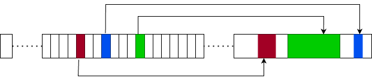
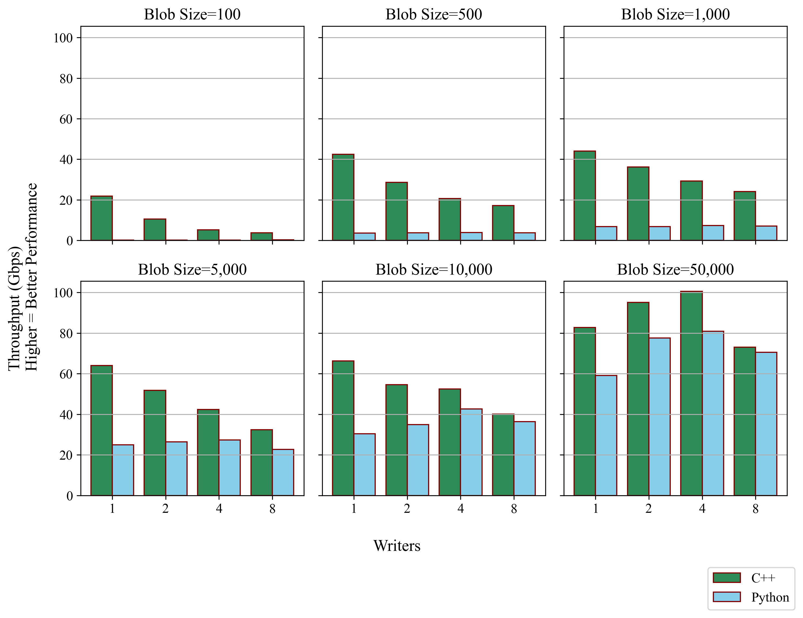

# Fast Random Access Log (FRAL)
FRAL is a concurrency-friendly log structure allocated over shared memory. Reads are random access and writes
are non-blocking. The current shared-memory framework uses memory-mapped files. The core engine is written in C++ and 
Python bindings are provided for higher level and less performance-constrained usage. Utilizing Python's 
struct library can easily extend the log to a language-agnostic shared memory framework as demonstrated [here](./fral/demo). 
Early workings for syncing FRALs over standard networking (using gRPC and Protobuf) in a non-intrusive and reliable way are also provided.
To normalize virtual memory addressing, allocation offsets from the start of the contiguous shared-memory space are 
stored in a fixed-sized array (see below).



The FRAL engine saw a ~60x performance multiple over a [similar interface](./fral/testing/performance/engine_sqlite.h) 
written with SQLite.

For more detail on the implementation and performance, see [this presentation](./misc/FRAL.pdf).


## Example Usage
The following simple usage is shown using two processes in parallel. Both the C++ and Python examples 
yield the below standard output:
```
TEST
TEST
DEST
```
### C++
```cpp
// Appender Process
auto ralA = fral::FRAL("test.bin");
const char *TEST_STR = "TEST";

auto blob = (char *) ralA.allocate(strlen(TEST_STR) + 1);
strcpy(blob, TEST_STR);
printf("%s\n", blob);

ralA.append(blob);
```
```cpp
// Reader Process
auto ralB = fral::FRAL("test.bin");

for(;;){
    auto blob2 = (char *) ralB[0];
    if(blob2){
        break;
    }
}

printf("%s\n", blob2);
blob2[0] = 'D';

auto blob3 = (char *) ralB[0];
printf("%s\n", blob3);
```

### Python
```Python
# Appender Process
ral_A = FRAL("test.bin")
test_bytes = "TEST".encode()

test_blob = ral_A.allocate(len(test_bytes))
test_blob[:len(test_bytes)] = test_bytes
print(bytes(test_blob).decode())
ral_A.append(test_blob)
```
```Python
# Reader Process
ral_B = FRAL("test.bin")

while True:
    test_blob2 = ral_B[0]
    if test_blob2:
        break
        
print(bytes(test_blob2).decode())
test_blob2[0:1] = 'D'.encode()

test_blob3 = ral_B[0]
print(bytes(test_blob3).decode())
```
### Performance Testing
#### Single Process Write Performance (1GB)
Testing the performance of writing 1GB with various allocation sizes and only one writer:

#### Multiprocess Write and Read Performance
Testing the performance of writing and reading 1GB with various allocation 
sizes and multiple writers:




